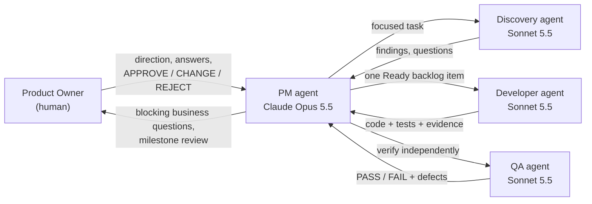

# Therapist Clinic Scheduling

A scheduling system for a therapy clinic. It keeps every client's recurring sessions correctly staffed, and it reorganises affected sessions safely when a therapist is on leave. **The real schedule never changes without an admin's explicit commit.**

> **Live demo: https://therapist-clinic-scheduling.vercel.app**
> Sign in as `maple@demo.clinic` (Maple pod) or `cedar@demo.clinic` (Cedar pod) with password `Demo!123`. Each can edit its own pod and view the other read-only.
> All data in this repository and in the demo is **synthetic**, with no real clients or staff. The demo resets every night.

## What it does

- **Pods and ranked therapists.** Each client has a major, 2nd and 3rd therapist, all from the same pod. Only these three may ever hold the client's sessions.
- **Rules enforced on every change:**
  - therapist weekly-hour caps;
  - no double-booking of therapists, clients or rooms (the 15 rooms are shared across pods);
  - office hours;
  - home visits, which take no room and count their full duration.
- **Leave becomes conflicts.** Recording leave, including partial days, immediately lists the affected sessions as conflicts. Leave that overlapped sessions already in the past becomes a non-blocking *historical alert*.
- **Auto resolve.** Proposes safe reassignments using the clinic's procedure:
  - next-ranked therapist first;
  - a bounded cascade of displaced sessions, with depth 0–2 set by the clinic;
  - a last-resort fallback that does not cascade.
  Every change shows *why*. Anything it cannot solve is listed with a reason.
- **Shared draft per pod.** Admins review proposals, apply them, edit freely, recheck, and then **commit atomically** with zero conflicts, or discard. Nothing is published until the commit.
- **Notification tasks.** One per affected client or therapist, with before and after details. Messages are tracked here, not sent automatically.
- **Two-admin access.** Admins sign in. Each edits only their assigned pod and can view every other pod read-only.
- **Reports.** Monthly staff reports, also downloadable as PDF, built only from committed sessions.

## Tech stack

Next.js 16 (App Router) · React 19 · TypeScript/ESM · PostgreSQL 17 · Better Auth · pdf-lib · Node 24 test runner · Docker Compose for local databases.

## Repository layout

```
agentic-clinic-starter-final/
  web/                  Next.js app (the product)
    app/                pages and API routes
    lib/                scheduling engine, store, access rules, PDF reports
    test/               integration and unit tests (isolated TEST database)
  scripts/              local env setup, demo data seed, first-admin tool, smoke checks
  SPEC.md               functional specification
  DECISIONS.md          every owner and PM decision (D-xxx)
  BACKLOG.md            all work items and their status
  SPRINT_7_REVIEW.md    latest milestone review, with a test script
.claude/agents/         AI agent team definitions (see "How this was built")
```

## Run it locally

Requires Node 24+ and Docker Desktop. All commands run from `agentic-clinic-starter-final/`.

```bash
npm --prefix web install
node scripts/ensure-local-env.mjs     # creates ignored local DEV/TEST credentials
npm run infra:up                      # starts PostgreSQL 17 for DEV and TEST
node scripts/seed-demo.mjs --env dev  # loads the synthetic demo clinic
npm run dev                           # http://localhost:3000
```

`npm run dev` runs a local demo mode that skips sign-in, using the ignored local env file. Demo mode is refused in production builds.

To use real sign-in locally, create an admin first. The password is typed at a hidden prompt:

```bash
node scripts/create-first-admin.mjs --env dev --pod a
```

Run the tests and the production build:

```bash
npm run web:test   # 75 tests against the isolated TEST database
npm run build
```

More detail is in `agentic-clinic-starter-final/DEV_SETUP.md` and `ENVIRONMENTS.md`.

## Why this exists, and how it was built

This project started from a real problem. A friend's clinic schedules its therapists by hand in Google Calendar. When a therapist calls in sick or takes a week off, someone has to work out who can cover each affected session. Every client may only see their own three ranked therapists. Therapists have weekly hour limits, and rooms are shared. All of it gets checked by hand. It's slow, error-prone, and easy to get wrong under pressure.

I also used it as an experiment: **can a team of AI agents build real, rule-heavy software if a human acts only as the Product Owner?** I didn't write the code. I set direction, answered business questions, and approved or rejected milestones. The agents did discovery, planning, coding and testing within a written process.

### The agentic workflow



**Roles**
- **Product Owner (me):** owns the product and makes the business calls: rules, priorities, trade-offs. Approves every milestone.
- **PM agent (Claude Opus 5.5):** the only agent that talks to me. It owns the backlog, the decision log and sprint planning. It reviews every worker's evidence before anything counts as done, and it commits the work.
- **Worker agents (Claude Sonnet 5.5),** each with a narrow role and hard limits (`.claude/agents/`):
  - **Discovery** is read-only. It walks realistic clinic scenarios, reconciles the spec against the code, and proposes backlog items and questions.
  - **Developer** builds one approved backlog item at a time, with tests. It cannot edit the governing documents or touch git.
  - **QA** verifies independently and never fixes. It runs tests, randomised old-versus-new comparisons, mutation checks, security probes and real browser walk-throughs.

**The process (Scrum-like, human-gated)**
1. **Scenario-based discovery.** Instead of abstract questions, agents trace realistic situations such as "a therapist on a two-week leave affecting 12 sessions" or "a same-morning sick call". Each finding is classified **BLOCKING**, **ADJACENT** or **TANGENTIAL**.
2. **The backlog is mandatory.** Every requirement, bug, task or process change is a backlog item. An item may enter a sprint only after passing a **Ready Gate**: clear intent, acceptance criteria, known dependencies, no open business ambiguity.
3. **Agents never invent business rules.** Ambiguity goes to the Product Owner as a numbered question (`OPEN_QUESTIONS.md`), and every answer is recorded as a decision (`DECISIONS.md`, e.g. D-B012).
4. **Every item is checked three times:** the developer's tests, the PM's own check, and an independent QA verification. Then it gets its own commit.
5. **Milestones are gated by me.** At each milestone I review a demo and choose **APPROVE**, **CHANGE**, **REJECT** or **EXPERIMENT**. Only APPROVE creates a git tag (`milestone/M1` … `M3`), which is a safe rollback point.
6. **Usage guard.** The agents stop at 70% of the usage limits, save an exact resume point, and continue automatically after the limit resets. They never buy extra usage.

**Two AI teams, one handoff.** The first milestones (the UX prototype and the PostgreSQL foundation) were built by an OpenAI Codex agent team (GPT-6 models). Mid-project the work was handed over to the Claude team. Because everything lived in written state (spec, backlog, decisions, handoff notes), the new team could audit the old work, find what was missing and carry on without losing context.

### What the experiment showed
- **Independent verification matters.** All 42 inherited tests passed, yet a QA benchmark showed the scheduling engine was quadratic. It would have frozen at real clinic size: 11 s per check, and Auto resolve never finished. The tiny test data hid it. It was fixed and now takes about 35 ms.
- **"Don't invent rules" needs enforcing.** Discovery found that an earlier agent had added a business rule blocking new leave during a draft, a rule I had never approved. It went back to me as a question and was reversed.
- **Checks catch their own blind spots.** QA mutation-tested a new test and showed that it couldn't catch the bug it was meant to guard against, and the test was strengthened. In another check, QA found a cross-pod data leak in error messages that the unit tests had missed.
- **The human stays in the loop for the right things.** I was asked about business rules, such as which session to move first, whether history should block scheduling, and who may see what. Implementation choices were left to the agents.

Every requirement, decision and bug is traceable in `SPEC.md`, `DECISIONS.md`, `BACKLOG.md` and the sprint reviews.

## Status

- **M2:** approved UX baseline.
- **M3 candidate:** the complete leave-disruption workflow, admin access and a performance rewrite. It is awaiting owner review; see `SPRINT_7_REVIEW.md`.
- **Next:** Google Calendar migration and integration, then production hosting.
